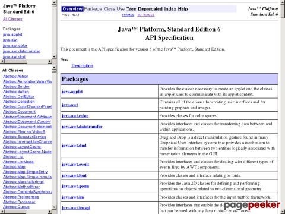
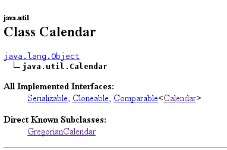
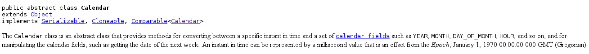
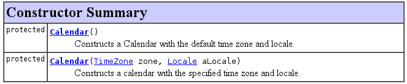
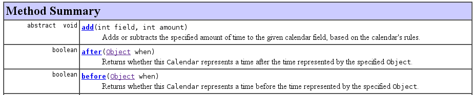
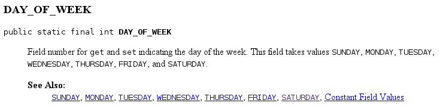
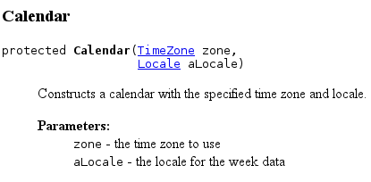

## Introdução
A API do Java nos fornece uma grande quantidade de classes para resolver os mais variados tipos de problemas. Toda a da API do Java que é documentada
através do javadoc. Logo saber ler e interpretar o javadoc garante o uso mais abrangente da API.

## Entenda a estrutura da página inicial do javadoc
Antes de ir direto para a parte do javadoc que exibe a documentação de uma classe, vamos ver como está organizada a estrutura da página que mos ajudará a navegar nos pacotes e classes.

Ao acessar o javadoc da API do Java 6 [(http://docs.oracle.com/javase/6/docs/api)](http://docs.oracle.com/javase/6/docs/api), temos a seguinte página:

Note que a página é divida em 3 partes, são elas:

- a primeira parte do lado esquerdo da página lista dos os pacotes existentes na API.
- Abaixo de Packages é exbido todas as classes existentes na API, ou ao clicar no nome de um pacote em Packages exibirá todas
as classes contidas no pacote selecionado.
- Na parte maior que está ao lado direito da página, além de listar novamente todos os pacotes mas agora contendo uma breve descrição sobre
as classes e interfaces contidas no pacote.

## Selecionando uma classe
É possível selecionar a documentação de uma classe de duas maneiras:
- selecionando primeiro o pacote  em *Packages* e depois a classe.
- indo direto na parte da página que exibe todas as classes(*All Classes*).

A selecionar uma classe será exibida uma página com informações sobre seu funcionamento e como usá-la.

Por exemplo, ao selecionarmos a classe [Calendar](http://docs.oracle.com/javase/6/docs/api/index.html?java/util/Calendar.html),  no início da página teremos informações básicas 
sobre a classe:

Então já é possível saber que:
- a classe `Calendar` faz parte do pacote `java.util`.
- é uma subclasse de `Object`.
- implementa as interfaces(*All Implemented Interfaces*) `Serializable`, `Cloneable`, `Comparable`.
- quais classes extendem(*Direct Known Subclasses*) `Calendar`.

Na sequência é informado como a classe é declarada, se é abstrata, seu nível de visibilidade e também uma descrição do que a classe faz.

No exemplo acima está informando que a classe `Calendar` é publica e abstrata, extende a classe `Object`, implementa
as interfaces `Serializable`, `Cloneable` e `Comparable`.

## Seções
Depois da descrição sobre a classe, temos as seguintes seções:

**Field Sumamry**  - lista todas as variáveis estáticas e de instância da classe.  
A coluna esquerda informa se é uma variável estática ou de instância além do seu nível de visibilidade. Na coluna direita informa o nome da variável e uma descrição da mesma.

**Constructor Summary** - lista todos os construtores da classe.  
Na coluna esquerda exibe o nível de visibilidade do construtor e na direita exibe os argumentos do construtor caso o mesmo possua algum.

**Method Summary**  - lista todos os métodos da classe.  
A coluna esquerda informa o nível de visibilidade do método, o que retorna ou se é void. Já na coluna direita temos a lista de argumentos que o método recebe.

## Detalhes de cada seção
Ao clicar em qualquer item listado nos sumários citados acima, você será direcionado para os detalhes de cada item, são eles:

**Field Details**  
A classe `Calendar` tem uma constante com o nome de `DAY_OF_WEEK`:
  

Logo é possível saber que essa variável é publica, estática, final e armazena um `int`.
Na descrição também informa o que é armazenado nesssa variável, nesse caso um valor inteiro correspondendo o dia
da semana.

**Constructor Detail**  
Aqui fornecerá todos os detalhes que para construir uma instância dessa classe.
  
`Calendar` tem um construtor que é `protected` e tem como parâmetros `TimeZone` e `Locale`.

**Method Detail**  
Nesse seção podemos obter detalhes do funcionamento de um método. Veja os detalhes do método `getInstance()`:

Nos detalhes do método `getInstance()` conseguimos saber que:
- O método é publico e estático
- Os parâmetros necessários para chamar o método(*Parameters*)
- O que o método retorna(*Returns*).

## Outros javadocs para ler:
[Guava] (http://docs.guava-libraries.googlecode.com/git-history/release/javadoc/index.html)  
[Guice] (http://google-guice.googlecode.com/git/javadoc/packages.html)
